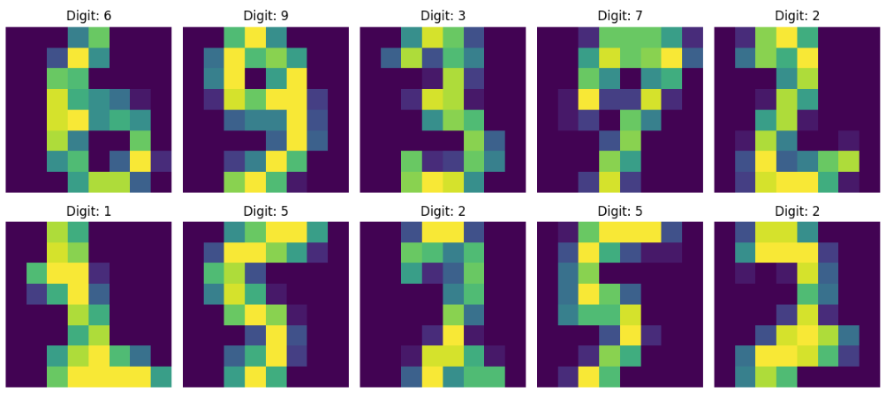

# MNIST Neural Network with PyTorch

Implementation of a neural network for MNIST handwritten digit classification using PyTorch. 



## Project Structure

```
├── main.py              # Main pipeline and CLI interface
├── model.py             # Neural network model definition
├── data_loader.py       # Data loading and preprocessing
├── train.py             # Training functions and optimizer comparison
├── evaluate.py          # Model evaluation and metrics
├── utils.py             # Visualization and utility functions
├── requirements.txt     # Python dependencies
└── README.md           
```

## Installation

1. Clone or download this repository
2. Install the required dependencies:


## create a virtual enviornment
once you are in the working directory, open the Terminal and type:

python -m venv .venv

Windows:
  .venv\Scripts\activate
Linux, MacOS:
  source .venv/bin/activate

then:
pip install -r requirements.txt


## Usage

### Basic Training

Train a neural network on MNIST with default parameters:

```bash
python main.py
```

### Custom Training Parameters

```bash
python main.py --epochs 50 --batch_size 128 --lr 0.001
```

### With Visualizations

```bash
python main.py --visualize
```

### Compare Different Optimizers

```bash
python main.py --compare_optimizers --visualize
```

### Save Trained Model

```bash
python main.py --save_model
```

### Command Line Options

- `--epochs`: Number of training epochs (default: 30)
- `--batch_size`: Batch size for training (default: 64)
- `--lr`: Learning rate (default: 0.001)
- `--data_dir`: Directory to store MNIST data (default: 'data')
- `--compare_optimizers`: Compare different optimizers
- `--visualize`: Show visualizations during training
- `--save_model`: Save the trained model

## Model Architecture

The neural network consists of:
- **Input Layer**: Flattened 28×28 grayscale images (784 features)
- **Hidden Layer 1**: Fully connected layer with 512 neurons + ReLU activation
- **Hidden Layer 2**: Fully connected layer with 512 neurons + ReLU activation
- **Output Layer**: Fully connected layer with 10 neurons (one for each digit 0-9)

## Performance

With default settings (30 epochs, SGD optimizer, lr=0.001), the model typically achieves:
- **Training Accuracy**: ~99%+
- **Test Accuracy**: ~90-95%

## Optimizer Comparison

The project includes functionality to compare different optimizers:
- **SGD**: Stochastic Gradient Descent
- **Adam**: Adaptive Moment Estimation
- **RMSprop**: Root Mean Square Propagation
- **Adagrad**: Adaptive Gradient Algorithm

## Visualization Features

- **Training Data Visualization**: Display sample images from the training set
- **Prediction Visualization**: Show model predictions with color-coded correctness
- **Confusion Matrix**: Detailed performance breakdown by class
- **Training History**: Loss and accuracy curves over epochs
- **Optimizer Comparison**: Side-by-side comparison of different optimizers


## Dependencies

- **PyTorch**: Deep learning framework
- **Torchvision**: Computer vision utilities and datasets
- **Matplotlib**: Plotting and visualization
- **NumPy**: Numerical computing
- **tqdm**: Progress bars


